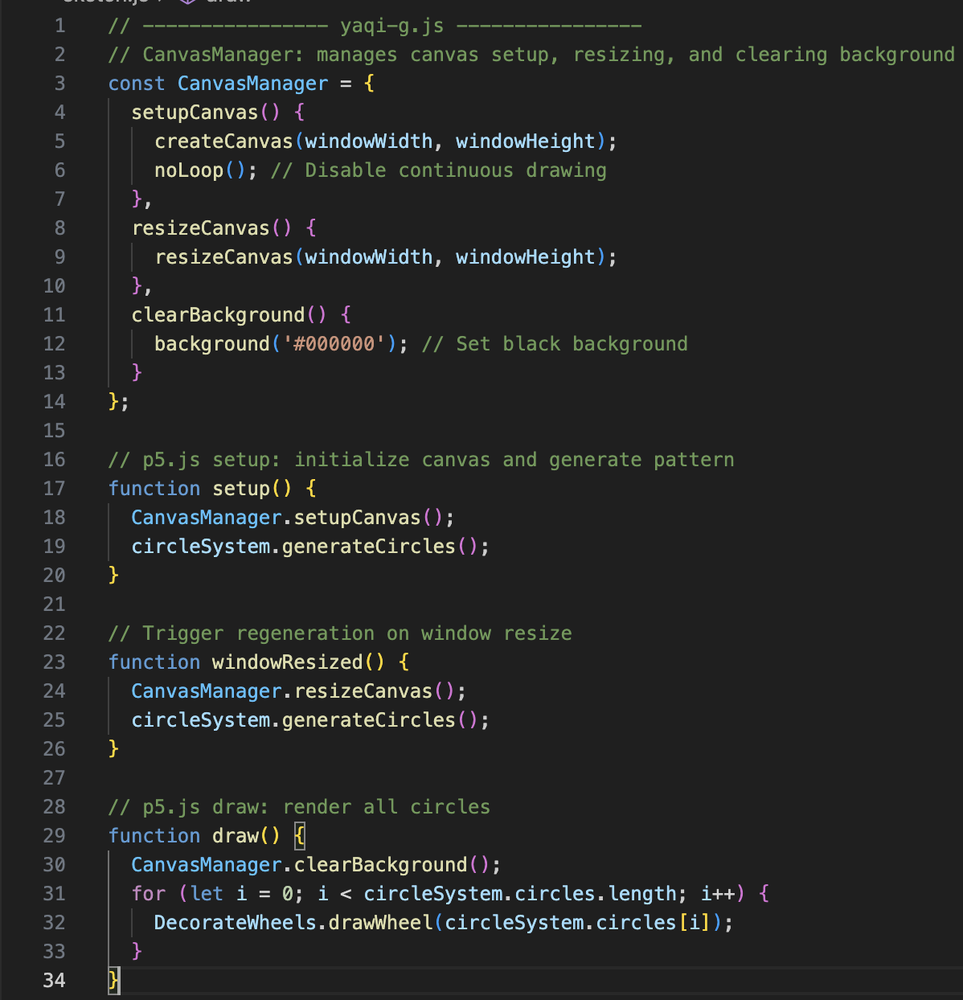

# Design Document
## Section 1 – Research and Inspiration
Our chosen artwork is titled Wheel of Fortune, which features a grid of vibrant circular forms layered concentrically and arranged in a staggered pattern. The work evokes both mystical symbolism and digital aesthetics, making it a rich source for creative coding reinterpretation. Our goal was to reimagine this image using generative and interactive techniques, creating a dynamic representation that emphasizes rhythm, structure, and chance.

### 1.1 Artistic Inspiration
#### The Original Artwork:
Wheel of Fortune by Pacita Abad directly influenced our code structure with the composition of colourful circular wheels and detailed accessories. Her use of vivid colour, layered textures, and designed compositions provided us with a framework for translating her physical complexity into computational logic (Abad, 1994). The structure of her work can be simplified into a set of geometrical shapes, we decided to use circle as our main shape in recreating her artwork. Each wheel can be deconstructed into concentric rings and radial symmetry. These circular modules form the foundational units of our generative system.

#### Op Art & Mandalas:
The repetitive, geometric nature of the wheels shares visual logic with both Op Art and spiritual mandala designs. Op Art’s use of visual illusion and rhythmic geometry guided the development of contrast and motion in our patterns (López-Pedraza, 1990). Similarly, the meditative structure of mandalas—a balance between chaos and control—echoes the hypnotic visual rhythm we aim to evoke (Cirlot, 2002). These influences encouraged us to explore symmetry, repetition, and animation as tools for crafting immersive visual experiences.

#### Jared Tarbell’s Generative Works:
Tarbell’s early generative art projects, such as Substrate and Happy Place, inspired us to approach our piece as a rule-based system with the potential for emergent complexity (Tarbell, n.d.). While our work remains more representational, the philosophy of building richness from simple, repeated forms aligns closely with Tarbell’s generative ethos. His interplay between algorithmic structure and organic variation informed the overall design logic behind our implementation.

#### Peter Halley’s Neo-Geo Abstraction:
To introduce a conceptual counterpoint to Abad’s organic expressiveness, we also drew inspiration from Peter Halley’s geometric abstraction. His work—composed of rigid “cells” and “conduits”—prompted us to consider the underlying systems within our artwork. Halley’s stark use of industrial colours and structural grids offered a contrasting perspective on how pattern and repetition can reflect institutional control, confinement, or connectivity (Halley, 1989). This influence encouraged us to think of each wheel not only as an aesthetic object, but as a symbol within a broader, abstracted network. The interplay between Halley’s systematic geometry and Abad’s exuberant layering ultimately shaped the duality at the heart of our visual and conceptual design.

### 1.2 Technical and Design Inspiration
- p5.js Grid-Based Systems: We were inspired by previous tutorials such as the random walker and image segmentation demos that emphasized class-based design and pixel-by-pixel reimaginings. This directly influenced how we built our Wheel class and handled positioning logic.
- Responsive Design in Creative Coding: Lessons from Week 9 shaped our approach to making the wheels fill the screen regardless of window size. The modular structure allowed us to use windowWidth and windowHeight along with dynamic spacing to generate as many wheels as needed responsively.
- Audio-Responsive Visuals (Coding Train): Since the animation for this project will be extended individually with methods such as Perlin noise, sound reactivity, and user interaction, we looked to Daniel Shiffman’s Coding Train videos for inspiration on how visuals can respond to external data sources (e.g., amplitude, frequency). This influenced how we planned the scalable properties of the wheel elements (e.g., size, color, stroke weight).

## Section 2 – Technical Planning

### 2.1 Module & Class Structure
**CanvasManager**  
- Responsibility: initialize and resize the drawing surface.  
- Interface:  
  - `setupCanvas()`: creates a full-window canvas.  
  - `resizeCanvas()`: recalculates dimensions on window resize.  
  - `clearBackground()`: fills the canvas with a solid base color.

**CircleManager**  
- Responsibility: compute a grid of wheel parameters (positions, radii, color palettes).  
- Approach:  
  - Determine a base radius proportional to the smaller of `windowWidth`/`windowHeight`.  
  - Derive grid spacing as twice the sum of that radius plus any decorative offset, plus a margin.  
  - Generate a 2D loop of `(i, j)` indices, map each to a 2D position via skewed vectors (–30° incline and its perpendicular), filtering to those that intersect the canvas.  
  - Produce an array of simple objects `{ x, y, radius, palette }`.

**DecorateWheels**  
- Responsibility: render one wheel per data object.  
- Responsibilities:  
  - Draw three solid concentric rings, each with its own color from the palette.  
  - Draw a fourth decorative stroke ring (the “chain”) with evenly spaced dots along its circumference.  
  - Expose a single method `drawWheel(params)` that accepts the positional and styling fields.

### 2.2 Screen-Fitting Strategy
- **Responsive Sizing**: all radii and spacings derive from `windowWidth`/`windowHeight`, so wheels remain proportional on any display.  
- **Dynamic Coverage**: calculate rows and columns to slightly overlap canvas edges—no blank strips appear regardless of aspect ratio.  
- **Recalculation on Resize**: in `windowResized()`, invoke both `CanvasManager.resizeCanvas()` and `CircleManager.generateCircles()`, then trigger a single redraw to reposition and re-render every wheel.

### 2.3 Preparation for Animation
- Reserve space in each wheel’s data object for:  
  - **Perlin seeds** (`seedPos`, `seedRad`, etc.) so that noise-driven drift, pulsing, color shifts can hook in without refactoring.  
  - **Audio or interaction hooks**, with placeholder properties (e.g. `amplitudeLevel`) to allow sound, mouse, or other inputs to integrate seamlessly.

### 2.4 External Techniques & References
- **Responsive Design Calculations** (Week 9 Tutorial): dynamic sizing and centering based on canvas aspect ratio.  
- **Transformations** (Week 10 Lecture): plan to use `translate()`, `rotate()`, and `scale()` for intra-wheel animations.  
- **Perlin Noise** (Week 11 Lecture): reserve hooks for `noise()`-based drift, pulsing, and organic color shifts.  
- **Modular OOP Patterns**: inspired by Daniel Shiffman’s p5.js examples (Coding Train).  
- **Code Reuse & Toolkit Mindset**: following Adrien M & Claire’s approach to building a reusable interactive toolkit.

## Section 3 – Implementation
### 3.1Early Iteration – Circle Position Layout Only

In our initial prototype, we focused on accurately replicating the geometric layout of the artwork. This version did not include any color, animation, or decoration. Instead, it purely demonstrated the underlying spatial logic of the piece: a grid of evenly spaced circles arranged in a staggered, offset pattern.

To achieve this, we used p5.Vector mathematics to calculate the position of each circle in a rotated grid. The grid is rotated by 15 degrees to match the visual angle of the original artwork, and alternate rows are shifted by half a step to create a dynamic, interlocking structure.

Each circle was rendered as a simple hollow outline using ellipse() with noFill() and a light gray stroke, emphasizing structure over ornamentation. This bare-bones version was critical for confirming that our math and responsive layout logic were functioning as expected.
|  |  |  |
|:--:|:--:|:--:|
| **Yaqi's Code** | **Regina's Code** | **Danni's Code** |

---

### 3.2 Iteration 2 – Adding Concentric Color Layers and Central Circle

In our second major iteration, we transitioned from a simple white circle layout to a more visually rich representation of the Wheel of Fortune structure by implementing multiple concentric rings with randomized colors.

To achieve this, we expanded each wheel into five layers (LAYERS = 5), each rendered as a colored ring with decreasing radii. We created a cols array for each wheel, storing random RGB colors assigned to each layer using the randomColor() function. These colors were applied sequentially from the outermost to the innermost ring using stroke() and ellipse() calls.

We also introduced a central circle at the core of each wheel to anchor the visual weight and emphasize the center. This circle uses a separate randomly generated color (centerCol) and a thicker strokeWeight, creating a distinct focal point.

The result of this stage was a structured and harmonious grid of multi-colored, concentric wheels that began to closely resemble the visual rhythm and radial symmetry of the original artwork. This iteration marked a clear step toward aligning with our inspirational references and laid the groundwork for further enhancements, such as radial decorations and animated interactions.
|  |  |  |
|:--:|:--:|:--:|
| **Yaqi's Code** | **Regina's Code** | **Danni's Code** |

---

### 3.3 Iteration 3 – Adding Radiating Dots and Visual Decoration

In our third development phase, we introduced decorative radial elements to each concentric layer of the wheels. This step significantly enriched the visual density and helped evoke the kaleidoscopic quality found in our reference artwork.

We implemented a new drawing pattern where evenly spaced circular dots were drawn along the circumference of each concentric ring. The number of dots increases for inner layers, calculated as `36 + i * 6`, where `i` is the index of the layer. Each dot shares the color of its corresponding ring and is drawn using `ellipse()` with no stroke, ensuring a vibrant, beaded look around each wheel.

This decision was inspired by generative art pieces that use repetition and rotation to produce intricate textures. Adding these dots not only enhanced the complexity but also visually distinguished each layer. From a technical standpoint, this pushed our class-based structure further and required more precise polar coordinate calculations within the `DecorateWheels.drawWheel()` method.

This iteration brought the visual identity of our sketch closer to our conceptual goals by fusing color, symmetry, and motion potential. It also set the stage for the next step: animation.

|  |  |  |
|:--:|:--:|:--:|
| **Yaqi's Code** | **Regina's Code** | **Danni's Code** |

---

### 3.4 Iteration 4 – Fully Responsive Layout with Staggered Grid

In our final group iteration, we implemented responsive canvas behavior and finalized the staggered grid system to ensure the sketch adapts to various screen sizes while maintaining consistent visual balance.

The responsive behavior was achieved by using `windowWidth` and `windowHeight` when creating the canvas and calculating all layout parameters—this ensures the spacing, radii, and number of wheels dynamically adapt to the screen size. We integrated the `windowResized()` function to recalculate the layout and redraw all wheels upon resizing the browser window.

To enhance the visual rhythm, we applied a staggered grid layout by introducing an alternating offset on every second row. Specifically, we used rotated vector math (15° incline) to calculate a skewed coordinate grid, and offset odd rows by half a unit. This creates a natural tessellation and avoids rigid horizontal/vertical alignments.

Together, these enhancements culminate in a dynamic, colorful, and mathematically coherent structure that represents both the visual logic and symbolic depth of the original *Wheel of Fortune*. This layout also provides a solid foundation for each group member’s individual animation layer, ensuring consistency across extensions.

## Section 4 – Technical Overview

Our final group code is built on a modular architecture with clear separation of responsibilities. Each component interacts through a shared data structure (circleSystem.circles) and operates within the p5.js lifecycle (setup(), draw(), windowResized()).

### 4.1 Module Structure
#### CanvasManager
Responsible for initializing and resizing the canvas, as well as background control.
<pre><code>const CanvasManager = {
  setupCanvas() {
    createCanvas(windowWidth, windowHeight);
    noLoop(); // ensures only one redraw unless manually triggered
  },
  resizeCanvas() {
    resizeCanvas(windowWidth, windowHeight);
  },
  clearBackground() {
    background('#000000');
  }
};
</code></pre>
- noLoop() prevents unnecessary re-drawing when not animating.
- Using windowWidth/windowHeight makes the canvas fully responsive.

#### circleSystem
Generates a grid of wheel objects with positioning, size, and color properties.
<pre><code>const a = p5.Vector.fromAngle(rotationAngle).mult(spacing);
const b = p5.Vector.fromAngle(rotationAngle + HALF_PI).mult(spacing);
</code></pre>
- These vectors rotate the grid 15° and compute staggered rows.
- We discovered and refined this method through ChatGPT, which helped us understand p5.Vector math not covered in class.
- The offset logic below ensures every second row is shifted:
<pre><code>if (j % 2 !== 0) {
  pos.add(offset); // apply half-step shift to odd rows
}</code></pre>
Each object pushed into the circles array includes position (x, y), radius, an array of layer colors (cols), and a central highlight color (centerCol).

#### DecorateWheels
This module renders each wheel using layered ellipses and decorative radial dots.
<pre><code>for (let i = 0; i < cols.length; i++) {
  const col = cols[i];
  const layerR = radius - i * (radius / circleSystem.LAYERS);
  stroke(col);
  ellipse(0, 0, layerR * 2);

  const numPoints = 36 + i * 6;
  for (let j = 0; j < numPoints; j++) {
    const ang = (TWO_PI / numPoints) * j;
    const px  = cos(ang) * layerR;
    const py  = sin(ang) * layerR;
    fill(col);
    ellipse(px, py, radius * 0.05);
  }
}</code></pre>
- The number of points increases inward (36 + i * 6), creating visual richness.
- The math for radial positioning (cos/sin) was initially adapted with the help of ChatGPT after experimenting with p5 polar coordinate examples.

A final center circle is drawn using a separate random color:
<pre><code>stroke(centerCol);
strokeWeight(radius * 0.05);
ellipse(0, 0, radius * 0.5);</code></pre>

#### Main Flow
The overall program flow can be summarized as:
<pre><code>setup() 
 └─> CanvasManager.setupCanvas()
 └─> circleSystem.generateCircles()
 
draw()
 └─> CanvasManager.clearBackground()
 └─> loop: DecorateWheels.drawWheel(circle)

windowResized()
 └─> CanvasManager.resizeCanvas()
 └─> circleSystem.generateCircles()</code></pre>

### 4.2 Use of External Tools and AI Assistance

While most techniques align with core p5.js teachings, we integrated several concepts from outside the classroom:
- p5.Vector Grid Rotation & Offset: The rotated grid system and vector math were adapted through iterative help from ChatGPT, which clarified how fromAngle() and mult() work together to place points diagonally with consistent spacing.
- Radial Dot Rendering: The logic for positioning evenly spaced dots around a circle was based on polar coordinate math we explored with ChatGPT’s assistance. This was crucial in achieving the ornamented style of the original artwork.
  
## Reference List
Abad, P. (1994). Wheel of fortune [Mixed media on stitched and padded canvas]. Pacita Abad Art Estate. https://pacitaabad.com/artwork/wheel-of-fortune/

Cirlot, J. E. (2002). A dictionary of symbols (2nd ed., J. Sage, Trans.). Routledge. (Original work published 1962)

Halley, P. (1989). Peter Halley: Collected essays 1981–1987. Galerie Bruno Bischofberger.

López-Pedraza, R. (1990). Cultural anxiety: Jungian perspectives on artistic form and illusion. Spring Publications.

Tarbell, J. (n.d.). Gallery of generative art. Complexification. http://www.complexification.net

